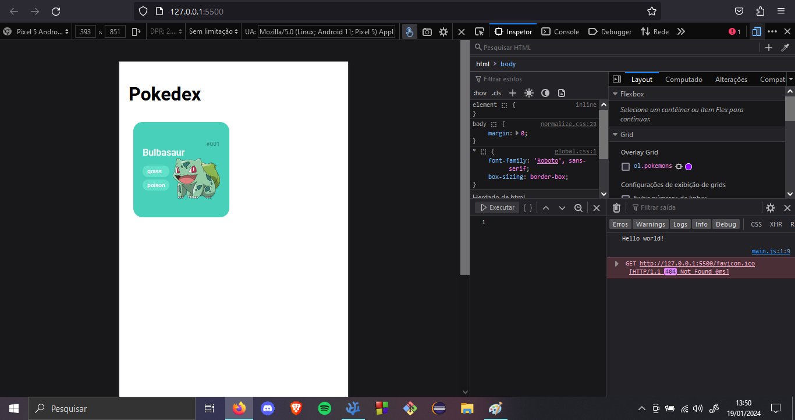
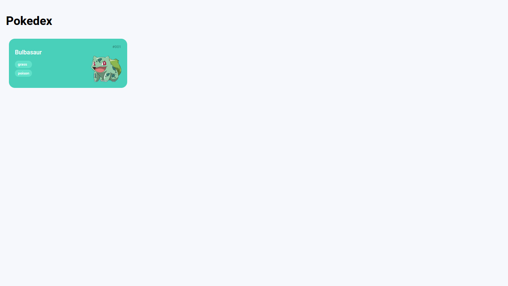

# Pokedex
Dinamic Pokedex project.

 This challenge/project has been given by DIO, in a CSS course.

# Stage 1

 Creating the layout for the dinamic aplicattion later. After some messing around with CSS and HTML, it started looking like this:

 

  Now after a few changes and some responsive addtions to make the page more flexible it is ready for the JS addons, and it is looking like this:

  

   Underwhelming maybe, BUT, now it looks pretty even on your grandma's phone. Now onto stage 2...

   # Stage 2

   ...